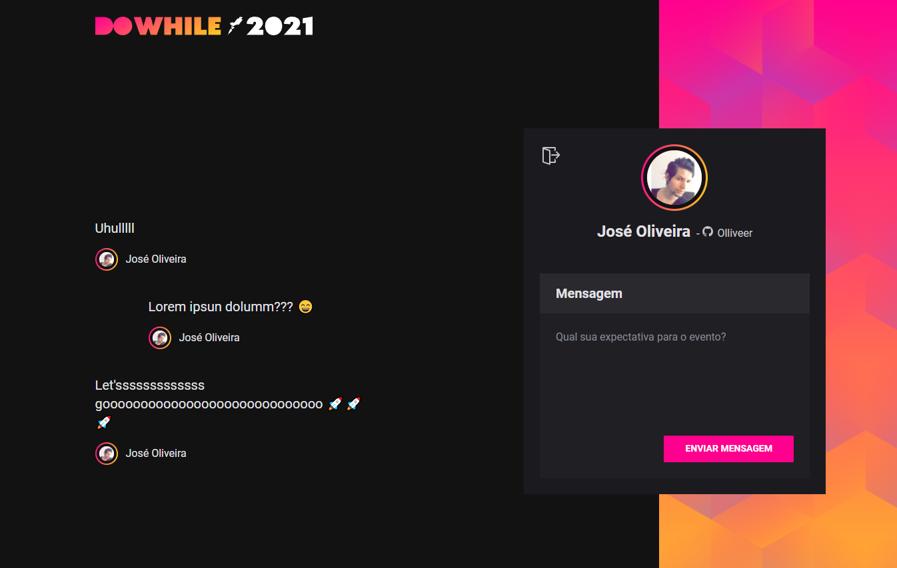

<h2 align="center">
  
  
  
  
</h2>

<h1 align="center">
  
</h1>

## 📌 Index

- [Sobre o projeto](#-sobre-o-projeto)
- [Screenshots](#-screenshots)
- [Techs](#-techs)
- [Instalação e Start](#-instalação-e-start)
- [Contribuições](#-contribuições)
- [License](#-license)

## ❔ Sobre o projeto

Plataforma de conversa em tempo real.

O projeto desenvolvido na [Next Level Week Heat](https://nextlevelweek.com)

## 📸 Screenshots

<h1 align="center">
  
</h1>

## 🛠 Techs

This project was developed using the following technologies:

- [TypeScript](https://www.typescriptlang.org/)
- [React](https://pt-br.reactjs.org/)
- [Node.js](https://nodejs.org/en/)
- [Express](https://expressjs.com/pt-br/)
- [SQLite](https://www.sqlite.org/index.html)
- [Socket.IO](https://socket.io/)
- [Vite](https://vitejs.dev/)

---

## 📜 License

O projeto está sobre a licença [MIT](./LICENSE)

---

